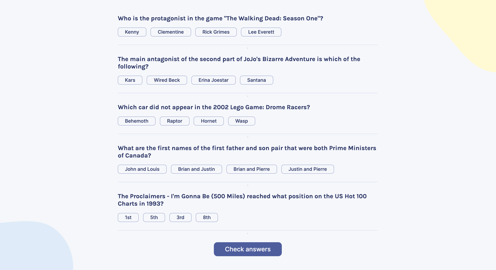
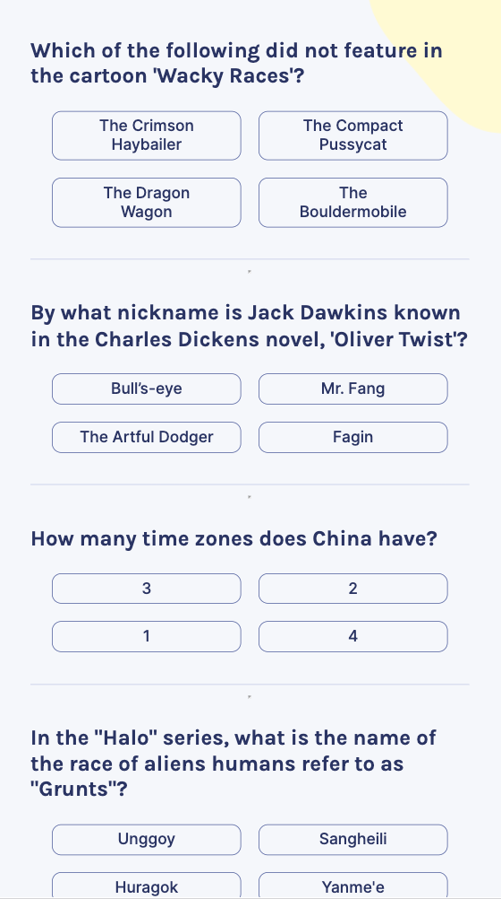
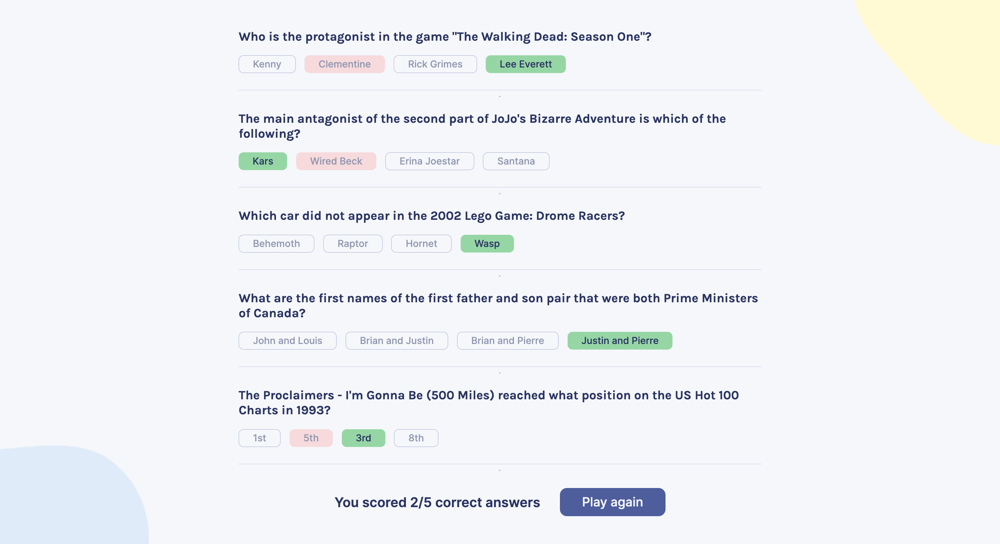
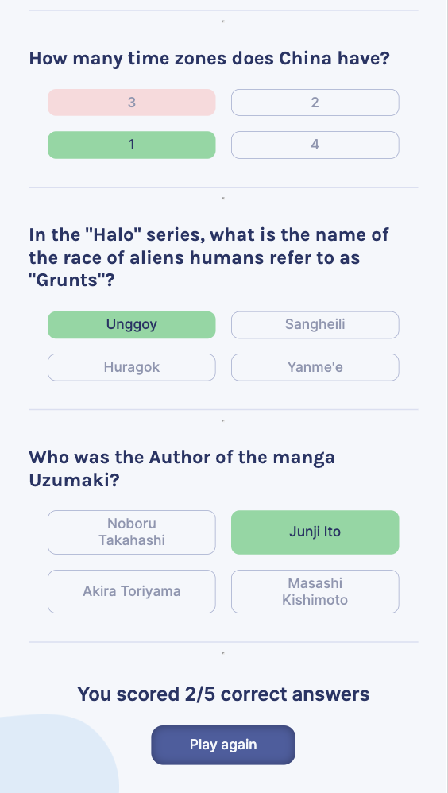

# Another game in my portfolio, the first one made with API, React, and TypeScript!

## About the project

This App asks users five random questions with four possible answers. The player's task is to choose the correct one and can change their mind anytime before clicking the "check answers" button. After that, scored points and correct answers are shown on the screen.

**[Check your knowledge](#) and have fun with that App!** 😉

## What did I learn during the course?

I built this App as a solo project after Module 11 of [The Frontend Developer Career Path](https://scrimba.com/learn/frontend) on Scrimba. This part was dedicated to taking the first steps in React.

I gained knowledge and skills about:
- basic `JSX` syntax with PascalCased names, objects as values, and JS inside of JSX,
- how to pass `props` (eventListeners included) to `components`, 
- how to initialize (sometimes in a lazy way) and update the React `State`, and pass it as a prop to the component,
- when to use `useEffect` with the cleanup function and dependencies array,
- how to make conditional rendering (`ternary` and logical operators), and
- how to create a `form` with React.

While building this solo project, I learned on my own how to:
- escape `HTML encoding` (I used the `DOMParser().parseFromString()` method),
- shuffle array's elements to render possible answers in a random order (I used the Durstenfeld shuffle algorithm), and
- keep an eye on the selected option and check if that's the correct one.

I also introduced `TypeScript` and `ESLint` to this project to work faster and ensure consistency in code. That was a real change in my workflow!

## What I polished?

I practiced the `.map` method to create components using data from an array, used the `...` spread operator on `objects` and `arrays`, put a `reduce` method to the final score calculation, and made `eventListener` callback functions with more than only the `event` parameter.

I also used the `fetch()` method to get data from [Open Trivia Database API](https://opentdb.com/api_config.php) and used the `try` and `catch` methods with `async`/`await` syntax).

In `CSS`, I figured out how to put two images on a background and style them separately. I also practiced using `calc()` and `clamp()` to make this App fully responsive and nice-looking. And finally, I added a loader to let the player know that questions are on their way to the screen.

## What it looks like:

| On a computer | On a mobile device |
| --- | ---|
| |  |
| |  |

